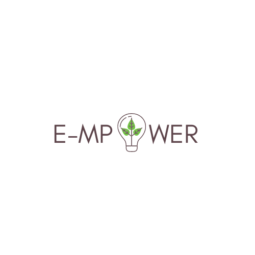

# E-MPOWER
 <br />
[](https://github.com/zhiyisoh/e-mpower/actions/workflows/maven.yml) <br />
Welcome to our CS203 repository, featuring E-MPOWER web application. 
## The Problem
In 2019, Singapore declared its goal of becoming a Zero Waste Nation, aiming for a 30 percent reduction in waste dumped into the Semakau Landfill by 2030. However, our lack of awareness and knowledge regarding e-waste management has led to unregulated e-waste taking up about 30% of the e-waste bin storage. Furthermore, only about 6 percent of the e-waste we generate each year is recycled, while about 25 percent is thrown out with food and other general waste. 

These are the top three pain points we have identified:
1. People are unsure of where the appropriate e-waste bins are to dispose of different types of regulated e-waste.
2. People are unsure on where to dispose of their unregulated e-waste. For example, some people will throw e-waste such as ovens and digital watches into the e-waste bins.
3. Many are unaware of the proper way to dispose of their items. They often dispose of their e-waste together with the original packaging, which results in the bins filling up faster.

## Our Solution
Our solution is E-MPOWER, an application that allows users to conveniently find the correct method to recycle their e-waste and bridge the gap in knowledge on e-waste management.

We plan to implement two key features: 


**1. E-waste Management Solution:**
The user will key in the type of e-waste they are planning to recycle. If the item is a regulated item, the application will request for the user’s current location and return the three nearest available e-waste bin that accepts that type of item. If the e-waste is not regulated, the application will give alternative options for the user to consider, such as taking the e-waste to a non-regulated e-waste collection point.

**2. E-waste Recycling Impact Scoring System:**
Users will be able to log their recycling efforts each time they dispose into the correct e-waste bin. By logging their recycling efforts, they are able to view their impact score which is measured by the amount of CO2 saved, hence being able to see the equivalent impact that they have contributed through their efforts.

## Why is our solution needed?
Our solution is needed in order to make managing e-waste more convenient and efficient by finding an appropriate e-waste bin in their location. Due to its convenience, people are more inclined to recycle their e-waste properly, which is essential in reducing the landfill and the production of greenhouse gases.

## The Team
<a href="https://github.com/zhiyisoh">Soh Zhi Yi</a>

<a href="https://github.com/bath-salt5">Kwek Zhi Yi</a>

<a href="https://github.com/jess-toh">Jess Toh</a>

<a href="https://github.com/chloekoh2021">Chloe Koh</a>

<a href="https://github.com/jesleen123">Jesleen Kaur</a>

<a href="https://github.com/abiyaimmaculate10">Abiya Immaculate</a>

# Getting Started with Local Deployment
## Requirements
Please ensure that you have `JDK 17`, `Node.js v16+`, `Maven 3.3` and `MySQL Workbench` installed in your machine.

## Steps to deploy application locally
### Step 1: Setting up database
Create new MySQL Schema in your localhost:3306 connection and name it `empowerdb`. 
```
create schema `empowerdb`;
```
Ensure that your root password is `root`. Alternatively, you can run this SQL statement to change your root password.
```
SET PASSWORD FOR 'root'@'localhost' = 'root'
    REPLACE '{your current password}';
```

### Step 2: Build Spring Boot backend
Spring Boot backend will be running on port 8080.
```
cd Backend/empower

# for Window users
mvnw spring-boot:run 

# for MacOS and Linux
./mvnw spring-boot:run 
```

### Step 3: Build Vue.js Frontend
```
cd FrontEnd

npm install
npm run dev
```

### Step 4: Open FrontEnd interface
Click on http://127.0.0.1:5173/ to access the UI. Enjoy the application! ❤️


